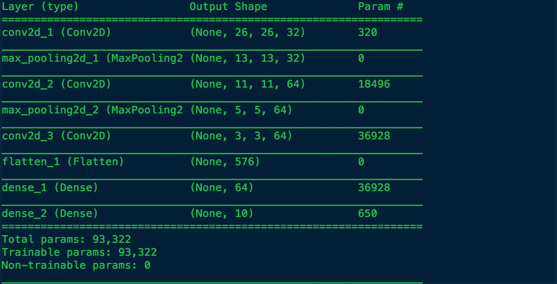

### CNN cơ bản

- Sự khác biệt cơ bản giữa **Dense layer** và **Convolution layer** đó chính là **Dense layer** khi train image sẽ học **global pattern** (toàn bộ pixel của ảnh) trong khi **Convolution layer** chỉ học **local pattern** (trong TH của ảnh sẽ là cửa sổ 2D có kích thước nhỏ)

- Dense layer thường sẽ được dùng ở cuối của CNN

- Như ví dụ trong file **CNN_basic.py** tầng Dense cuối cùng sẽ có kích cỡ 10, vì lí do đó nó có khả năng phân loại cho 10 loại đầu ra. Mạng CNN xây dựng được sẽ có kiến trúc như sau:

